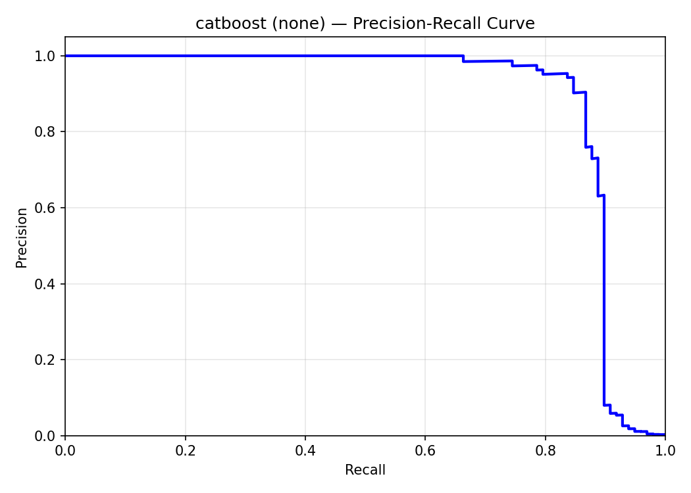
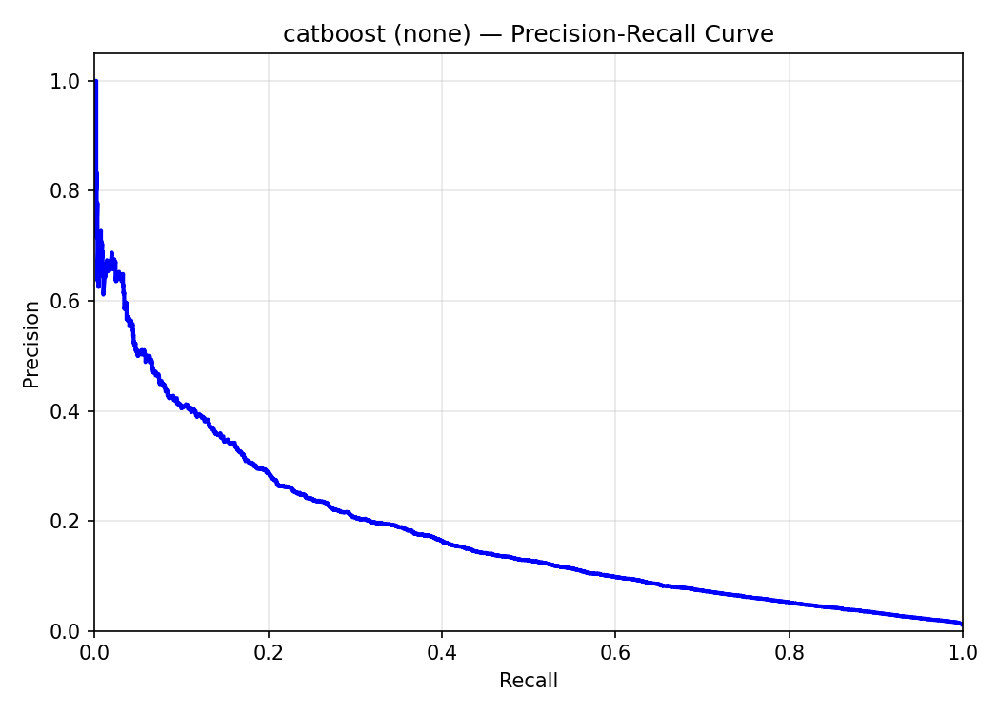

# Financial Fraud Detection under Extreme Class Imbalance

**A leakage-free comparative study of classical machine learning and tabular transformers.**

Fraud detection is not simply a question of classification accuracy: fraudulent
cases are rare, missed fraud has a cost, and false alerts create a review burden.
This MSc project investigates how model choice, imbalance handling and
validation-selected decision thresholds affect predictive performance and
operational trade-offs on two financial-fraud benchmarks.

Developed by **Olavo Miguel Cabaço Caixeiro**, MSc in Applied Informatics,
Universidade Politécnica de Santarém, under the supervision of
**Maryam Abbasi** and **Pedro Martins**.

[Read the final dissertation](deliverables/2026_24_08_Thesis_MSc_Olavo_Final.pdf)
· [Explore saved experiments](results/)
· [Inspect the code](src/)
· [Get started](#getting-started)

## Main findings

No single model or intervention dominates every criterion.

| Finding | Evidence from the evaluated setting |
|---|---|
| Strong classical baselines remain competitive. | CatBoost achieves the highest baseline PR-AUC on ULB: **0.8847**. On BAF Base, FT-Transformer (**0.1797**), CatBoost (**0.1796**) and LightGBM (**0.1768**) have closely grouped point estimates. |
| The decision threshold matters operationally. | On BAF Base, LightGBM's TEST F2 increases from **0.042** at threshold 0.5 to **0.316** using the DEV-selected max-F2 rule. Threshold selection changes alerts, precision and recall, not PR-AUC. |
| Imbalance interventions are model- and dataset-dependent. | FT-Transformer's BAF PR-AUC falls by approximately **41%** with SMOTE under the implemented pipeline. Interpolation of ordinal categorical codes is a confound: this is not evidence that SMOTE universally harms transformers. |
| Within-dataset performance does not determine transfer performance. | With Base-trained models and thresholds frozen, Random Forest has the highest PR-AUC and F2 point estimates on **all five BAF Variant TEST sets**. |
| Interpretation requires compatible methods. | Compatible SHAP analyses support top-feature-set agreement; FT-Transformer's diffuse final-layer attention is a separate descriptive diagnostic, not a causal explanation. |

Sources: [ULB baseline](results_thesis/tables/ulb/baseline.tex),
[BAF baseline](results_thesis/tables/baf/baseline.tex),
[threshold comparison](results_thesis/tables/baf/threshold_f2.tex),
[full results and limitations](Overleaf/Chapters/5-Results.tex),
[transfer PR-AUC](results_thesis/tables/baf/crossdomain_prauc.tex) and
[transfer F2](results_thesis/tables/baf/crossdomain_f2.tex).
Displayed values are rounded; detailed comparisons use the saved full-precision artefacts.

### What the precision–recall trade-off looks like

These original TEST curves show the same baseline model, CatBoost, without
resampling on each benchmark. BAF supports substantially lower precision across
much of the recall range. The plots illustrate why results must be interpreted
within each dataset, rather than through accuracy alone.

| ULB 2013 — PR-AUC 0.8847 | BAF Base — PR-AUC 0.1796 |
|---|---|
|  |  |

PR-AUC depends on both score separation and class prevalence. These are
different benchmarks, not a controlled experiment isolating the cause of the
performance gap. All-model curves are also available for
[ULB](results_thesis/figures/ulb/pr_curves_baseline.pdf) and
[BAF](results_thesis/figures/baf/pr_curves_baseline.pdf).

## Research questions and experimental design

The dissertation addresses five research questions:

1. How do classical models and FT-Transformer compare under a leakage-free protocol?
2. How does validation-derived threshold selection affect operational performance?
3. How do imbalance-handling strategies interact with model family and dataset?
4. How do Base-trained models generalise to the controlled BAF variants?
5. What do compatible SHAP feature-set comparisons and FT-Transformer attention diagnostics reveal?

| Component | Protocol |
|---|---|
| Datasets | ULB Credit Card Fraud 2013: 284,807 transactions, 492 frauds (approximately 0.173%). BAF Base: 1,000,000 applications, approximately 1.1% fraud; five additional million-row variants for transfer evaluation. |
| Supervised models | Logistic Regression, Random Forest, LightGBM, CatBoost and FT-Transformer. |
| Anomaly baseline | One-Class SVM, evaluated separately from the supervised factorial design. |
| Imbalance configurations | None, random undersampling, random oversampling, SMOTE, SMOTE–Tomek, SMOTEENN and class weights. |
| Data separation | Stratified 80% DEV / 20% TEST, seed 42; preprocessing fitted within the relevant training partition. |
| Model selection | 50 Optuna trials for each supervised baseline: five-fold inner validation for classical models, one internal DEV holdout for FT-Transformer. Baseline hyperparameters reused across imbalance strategies. |
| Decision rules | Fixed 0.5, max-F1, max-F2 and a validation precision target of at least 0.5; no TEST-based threshold tuning. |
| Transfer | Frozen BAF Base models, preprocessing and thresholds evaluated on each Variant's 20% TEST partition; no Variant-specific retraining. |
| Evaluation | PR-AUC (average precision), ROC-AUC, F1/F2, precision, recall, alert burden and computational cost; conditional TEST bootstrap intervals. |

The complete protocol is in the [Methodology](Overleaf/Chapters/4-Methodology.tex).

### Evidence boundaries

- Results come from one outer split and the saved fitted runs, not repeated-seed experiments.
- Overlapping marginal confidence intervals do not establish statistical equivalence.
- BAF transfer is a controlled benchmark stress test, not independent-bank validation.
- FT-Transformer categorical-gradient SHAP is excluded from cross-model conclusions.
- OCSVM's clipped decision scores are not probabilities; its Brier values are not comparable.
- This is research code, not a production fraud-monitoring or automated decision system.

## Getting started

### 1. Obtain the repository

Install **Git**, **Git LFS** and **Python 3.12** first. Saved runs record
Python **3.12.7 on Windows 11**. Commands below use **Windows PowerShell**
unless otherwise indicated and are run from the repository root.

Clone without automatically downloading the large LFS artefacts:

```powershell
git lfs install
git -c filter.lfs.process= -c filter.lfs.smudge= -c filter.lfs.required=false clone https://github.com/Olavo200100274/FraudDetection.git
cd FraudDetection
```

The code, metric JSON files and README figures can be inspected without model
downloads. LFS files remain small pointers until fetched. For a full local
archive, run `git lfs pull`: the current tracked LFS files total approximately
**7.8 GiB**, in addition to ordinary Git files and history.

### 2. Install dependencies

```powershell
py -3.12 -m venv .venv
.\.venv\Scripts\Activate.ps1
python -m pip install --upgrade pip
```

Choose **one** installation route.

**Recorded NVIDIA/CUDA environment:**

```powershell
python -m pip install -r requirements.txt
```

The requirements pin PyTorch 2.5.1 with CUDA 12.1. GPU execution requires a
compatible NVIDIA driver. The recorded hardware was an Intel Core i5-13600KF,
16 GB RAM and an NVIDIA RTX 3070 with 8 GB VRAM; this is a reference
configuration, not a certified minimum.

**CPU-only alternative:**

```powershell
$projectPackages = Get-Content requirements.txt | Where-Object { $_.Trim() -and $_ -notmatch '^(--|torch==)' }
python -m pip install $projectPackages
python -m pip install torch==2.5.1 --index-url https://download.pytorch.org/whl/cpu
```

This preserves the other dependency pins without modifying the repository.
Do not subsequently install the unmodified requirements file into the CPU
environment, as it requests the CUDA build again. See the
[official PyTorch installation options](https://pytorch.org/get-started/previous-versions/#v251)
for other platforms. On Linux, create the environment with
`python3.12 -m venv .venv` and activate it with `source .venv/bin/activate`;
PowerShell-specific commands need shell equivalents.

Check dependency consistency:

```powershell
python -m pip check
python -c "import torch; print('PyTorch:', torch.__version__); print('CUDA available:', torch.cuda.is_available())"
```

These instructions document the recorded environment and a CPU alternative;
they are not a fresh-install certification across platforms. Full searches
can take hours, and identical numerical results across hardware or dependency
changes are not guaranteed.

### 3. Obtain the datasets

For a first ULB run, fetch only that CSV:

```powershell
git lfs pull --include="datasets/creditcard_2013.csv"
```

For both benchmarks and BAF transfer:

```powershell
git lfs pull --include="datasets/*.csv"
```

Alternatively, obtain the datasets from their original sources and place the
CSV files under `datasets/` with these exact names:

| Source | Local files | CLI identifier |
|---|---|---|
| [ULB Credit Card Fraud Detection](https://www.kaggle.com/datasets/mlg-ulb/creditcardfraud) | `creditcard_2013.csv` (rename the original `creditcard.csv`) | `ulb` |
| [Feedzai BAF Dataset Suite](https://github.com/feedzai/bank-account-fraud) | `Base.csv`, `Variant I.csv`, `Variant II.csv`, `Variant III.csv`, `Variant IV.csv`, `Variant V.csv` | `baf_base`, `baf_var1`–`baf_var5` |

Follow each dataset's own access, attribution and licence terms. File hashes
are recorded in experiment `config.json` files. A CSV containing a Git LFS
pointer is not a usable dataset: fetch the actual object before running.

## Running and reproducing the experiments

> **Keep exploratory runs separate from the reference archive.** Training
> writes timestamped folders under `results/`, and several downstream scripts
> automatically select the latest run. Use a separate disposable clone for the
> smoke test below, and a fresh clone for full-data reproduction. A small test
> run must not become the baseline for a full-data comparison. Analysis scripts
> can overwrite derived files within existing run folders.

### Quick pipeline check

After installing dependencies and fetching ULB in the disposable clone:

```powershell
python src/main.py --dataset ulb --models logreg --strategy none --sample 0.05 --n_trials 1
```

This checks a small training path; it does **not** reproduce a dissertation
result. It still performs fitting and evaluation and is not an instant unit test.

### Full-data training

Run the baseline first, then the six non-baseline imbalance configurations:

```powershell
python src/main.py --dataset ulb --models all --strategy none --n_trials 50
python src/main.py --dataset baf_base --models all --strategy none --n_trials 50
python src/main.py --dataset ulb --models logreg rf lgbm catboost --strategy all
python src/main.py --dataset baf_base --models logreg rf lgbm catboost --strategy all
python src/main_transformer.py --dataset ulb --strategy none --n_trials 50
python src/main_transformer.py --dataset baf_base --strategy none --n_trials 50
python src/main_transformer.py --dataset ulb --strategy all
python src/main_transformer.py --dataset baf_base --strategy all
```

Here, `--strategy all` means **all non-baseline strategies**; it does not
include `none`. Classical `--models all` includes OCSVM, but not
FT-Transformer. Strategy runs reuse parameters from the latest matching
baseline. For a single experiment, select one model and strategy, for example
`--models lgbm --strategy weights`.

### Thresholds, transfer and interpretability

After full-data baselines exist, the following commands reproduce the analysis
stages. To work from the archived models instead, use a fresh clone and fetch
their binary artefacts with `git lfs pull --include="results/**"`, as well as
the required datasets.

```powershell
python src/threshold_study.py --dataset ulb
python src/threshold_study.py --dataset baf_base
python src/cross_domain.py --models all
python src/shap_analysis.py --models logreg lgbm catboost
python src/attention_analysis.py --dataset baf_base
```

Threshold analysis involves additional DEV fitting, including reconstruction of
the FT-Transformer validation model; it is not merely a reformatting of saved
TEST metrics. Transfer uses the saved Base model without Variant retraining.
SHAP is deliberately restricted above to the compatible primary explainers.

Generate derived tables and figures from available artefacts with:

```powershell
python src/generate_results.py
```

This writes into `results_thesis/`; it does not rebuild the dissertation or
automatically reproduce every final editorial exclusion. Inspect the output
against the final thesis before reusing it.

## Navigating the evidence

| Path | Contents |
|---|---|
| [src/](src/) | Data loading, training, evaluation, transfer, SHAP, attention and result-generation scripts. |
| [results/](results/) | Timestamped runs: configurations, metrics, models, predictions and analysis outputs. |
| [results_thesis/](results_thesis/) | Generated tables and figures, including some exploratory or superseded outputs. |
| [notebooks/](notebooks/) | Exploratory dataset analysis. |
| [Overleaf/](Overleaf/) | Dissertation LaTeX source; `main.tex` is the entry point. |
| [deliverables/](deliverables/README.md) | Final dissertation PDF and a preserved earlier thesis version, with file roles documented. |
| [Article 1/](Article%201/) and [Article 2/](Article%202/) | Related draft manuscripts and template resources; not evidence of journal acceptance. |

A typical experiment is stored under
`results/<dataset>/<model>/<strategy>/run_<timestamp>/`. Start with
`config.json` for the procedure, `metrics_test.json` for TEST results and
`metrics_cv.json` for validation evidence. ULB outputs use the directory name
`ulb_2013`, although the training CLI identifier is `ulb`.

**The final dissertation governs which analyses support the reported
conclusions.** For example, generated SHAP-consistency tables still contain
exploratory FT-Transformer comparisons, and generated baseline tables retain
OCSVM Brier values excluded from the thesis comparison. The historical SHAP
dependence figure is also excluded from the final document. Preserving an
artefact does not endorse every associated interpretation.

## Dissertation and attribution

The [final 111-page dissertation](deliverables/2026_24_08_Thesis_MSc_Olavo_Final.pdf),
dated **24 August 2026**, is the reference document for this repository.
To compile its source, import the contents of `Overleaf/` into Overleaf and
select `main.tex` with the pdfLaTeX compiler. The archived final PDF remains
the reference build.

When referring to this work, identify the author, full title, institution and
year, and include the repository URL and the commit used for your analysis:

> Caixeiro, Olavo Miguel Cabaço (2026). *Financial Fraud Detection under Extreme
> Class Imbalance: A Leakage-Free Comparative Study of Classical Machine
> Learning and Tabular Transformers*. MSc dissertation, Universidade
> Politécnica de Santarém.

Dataset authors and third-party methods should be cited separately; see the
[dissertation bibliography](Overleaf/references.bib).

The local literature library and academic review records are excluded from the
current repository tree; they are not needed to compile the thesis or reproduce
the experiments. Earlier commits may still contain historical copies.

No project-wide open-source licence is currently declared. Public availability
does not itself grant a blanket reuse licence; datasets, third-party papers,
templates and institutional assets retain their respective terms.
